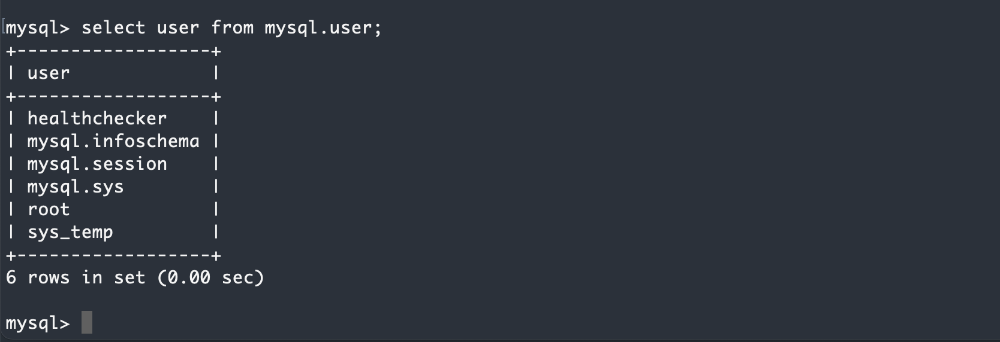
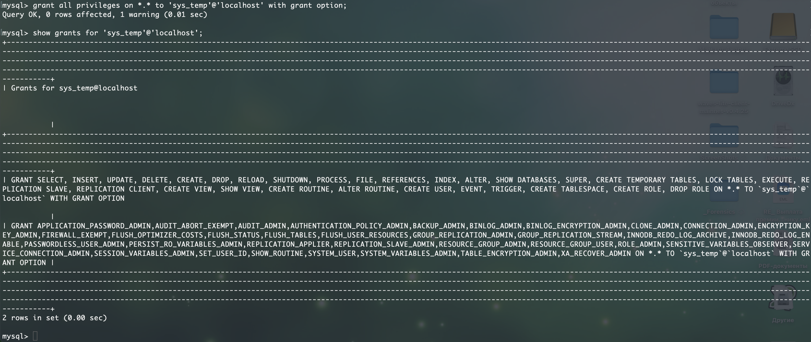
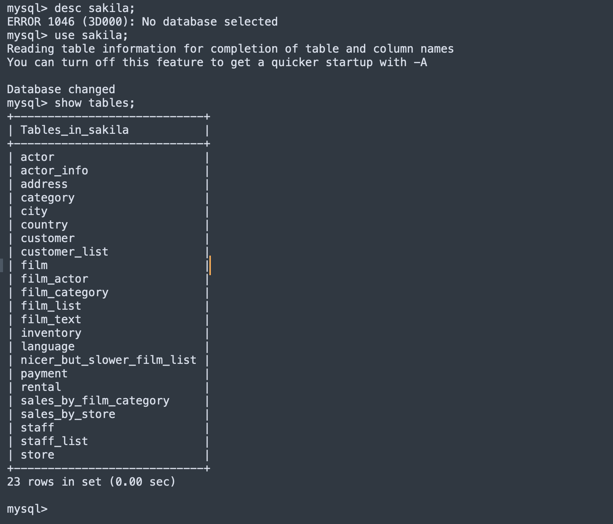

# Домашнее задание к занятию «Работа с данными (DDL/DML)»

---

Задание можно выполнить как в любом IDE, так и в командной строке.

### Задание 1
1.1. Поднимите чистый инстанс MySQL версии 8.0+. Можно использовать локальный сервер или контейнер Docker.

1.2. Создайте учётную запись sys_temp. 

1.3. Выполните запрос на получение списка пользователей в базе данных. (скриншот)

1.4. Дайте все права для пользователя sys_temp. 

1.5. Выполните запрос на получение списка прав для пользователя sys_temp. (скриншот)

1.6. Переподключитесь к базе данных от имени sys_temp.

Для смены типа аутентификации с sha2 используйте запрос: 
```sql
ALTER USER 'sys_test'@'localhost' IDENTIFIED WITH mysql_native_password BY 'password';
```
1.6. По ссылке https://downloads.mysql.com/docs/sakila-db.zip скачайте дамп базы данных.

1.7. Восстановите дамп в базу данных.

1.8. При работе в IDE сформируйте ER-диаграмму получившейся базы данных. При работе в командной строке используйте команду для получения всех таблиц базы данных. (скриншот)

*Результатом работы должны быть скриншоты обозначенных заданий, а также простыня со всеми запросами.*

#### Ответ на задание 1.

1.3. Запрос на получение списка пользователей. Скриншот:


1.5. Результат выполнения запроса на наличие прав у пользователя:


1.8. Результат импорта дампа базы в созданную БД:


<details>

<summary>Простыня команд:</summary>

```SQL
bash-4.4# mysql -u sys_temp -p
Enter password: 
Welcome to the MySQL monitor.  Commands end with ; or \g.
Your MySQL connection id is 176
Server version: 8.0.32 MySQL Community Server - GPL

Copyright (c) 2000, 2023, Oracle and/or its affiliates.

Oracle is a registered trademark of Oracle Corporation and/or its
affiliates. Other names may be trademarks of their respective
owners.

Type 'help;' or '\h' for help. Type '\c' to clear the current input statement.

mysql> show databases;
+--------------------+
| Database           |
+--------------------+
| information_schema |
| mysql              |
| performance_schema |
| sys                |
+--------------------+
4 rows in set (0.00 sec)

mysql> create database sakila;
Query OK, 1 row affected (0.01 sec)

mysql> ^DBye
bash-4.4# pwd
/
bash-4.4# exit

root@debian-andaks:/.andaks/docker/sakila-db# docker cp sakila.mwb mysql-server:/
                                             Successfully copied 42kB to mysql-server:/
root@debian-andaks:/.andaks/docker/sakila-db# docker cp sakila mysql-server:/
sakila-data.sql    sakila.mwb         sakila-schema.sql  
root@debian-andaks:/.andaks/docker/sakila-db# docker cp sakila-data.sql mysql-server:/
                                             Successfully copied 3.35MB to mysql-server:/
root@debian-andaks:/.andaks/docker/sakila-db# docker cp sakila-schema.sql mysql-server:/
                                             Successfully copied 26.1kB to mysql-server:/
root@debian-andaks:/.andaks/docker/sakila-db# docker exec -it mysql-server bash
bash-4.4# ll
bash: ll: command not found
bash-4.4# ls
bin   dev			  entrypoint.sh  healthcheck.sh  lib	media  opt   root  sakila-data.sql    sakila.mwb  srv  tmp  var
boot  docker-entrypoint-initdb.d  etc		 home		 lib64	mnt    proc  run   sakila-schema.sql  sbin	  sys  usr
bash-4.4# 
bash-4.4# 
bash-4.4# mysql -u sys_temp -p <sakila-schema.sql 
Enter password: 
ERROR 1045 (28000): Access denied for user 'sys_temp'@'localhost' (using password: YES)
bash-4.4# 
bash-4.4# 
bash-4.4# mysql -u sys_temp -p sakila <sakila-schema.sql 
Enter password: 
bash-4.4# mysql -u sys_temp -p sakila <sakila-data.sql   
Enter password: 
bash-4.4# 
bash-4.4# 
bash-4.4# mysql -u sys_temp -p
Enter password: 
Welcome to the MySQL monitor.  Commands end with ; or \g.
Your MySQL connection id is 201
Server version: 8.0.32 MySQL Community Server - GPL

Copyright (c) 2000, 2023, Oracle and/or its affiliates.

Oracle is a registered trademark of Oracle Corporation and/or its
affiliates. Other names may be trademarks of their respective
owners.

Type 'help;' or '\h' for help. Type '\c' to clear the current input statement.

mysql> show databases;
+--------------------+
| Database           |
+--------------------+
| information_schema |
| mysql              |
| performance_schema |
| sakila             |
| sys                |
+--------------------+
5 rows in set (0.00 sec)

mysql> desc sakila;
ERROR 1046 (3D000): No database selected
mysql> use sakila;
Reading table information for completion of table and column names
You can turn off this feature to get a quicker startup with -A

Database changed
mysql> show tables;
+----------------------------+
| Tables_in_sakila           |
+----------------------------+
| actor                      |
| actor_info                 |
| address                    |
| category                   |
| city                       |
| country                    |
| customer                   |
| customer_list              |
| film                       |
| film_actor                 |
| film_category              |
| film_list                  |
| film_text                  |
| inventory                  |
| language                   |
| nicer_but_slower_film_list |
| payment                    |
| rental                     |
| sales_by_film_category     |
| sales_by_store             |
| staff                      |
| staff_list                 |
| store                      |
+----------------------------+
23 rows in set (0.00 sec)


mysql> 
<details>
</details>
```

---

### Задание 2
Составьте таблицу, используя любой текстовый редактор или Excel, в которой должно быть два столбца: в первом должны быть названия таблиц восстановленной базы, во втором названия первичных ключей этих таблиц. Пример: (скриншот/текст)
```
Название таблицы | Название первичного ключа
customer         | customer_id
```


## Дополнительные задания (со звёздочкой*)
Эти задания дополнительные, то есть не обязательные к выполнению, и никак не повлияют на получение вами зачёта по этому домашнему заданию. Вы можете их выполнить, если хотите глубже шире разобраться в материале.

### Задание 3*
3.1. Уберите у пользователя sys_temp права на внесение, изменение и удаление данных из базы sakila.

3.2. Выполните запрос на получение списка прав для пользователя sys_temp. (скриншот)

*Результатом работы должны быть скриншоты обозначенных заданий, а также простыня со всеми запросами.*
